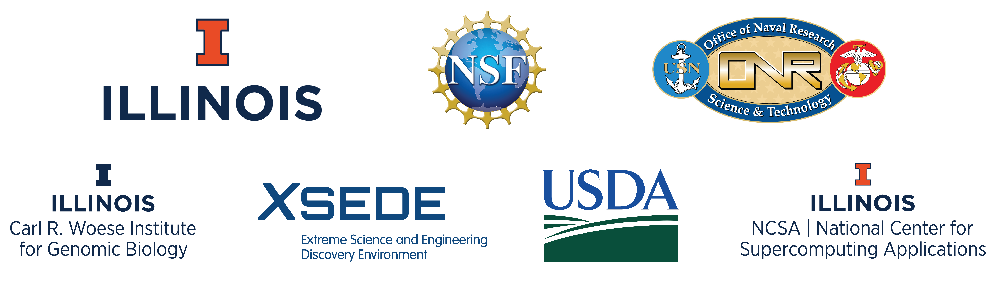

*****
About
*****

**Elastica** is a *free* and *open-source* software project for the simulation of assemblies of slender one-dimensional bodies using Cosserat Rod theory. It has been designed to be modular, extensible and easy to use. It allows the user to define a collection of Cosserat rods subject to both external (i.e. gravity, friction, etc...) and internal (i.e. muscle torque) forces. Rods account for self-contact and can be combined to create assemblies of rods, which can then be used to model increasingly complex system.

For more information on Elastica and Cosserat rods, see the project website https://cosseratrods.org

Elastica is developed and maintained by the Gazzola Lab at the University of Illinois at Urbana-Champaign. For more information on the projects we work on, see https://mattia-lab.com. 

Funding for the development of Elastica has been provided by:  

